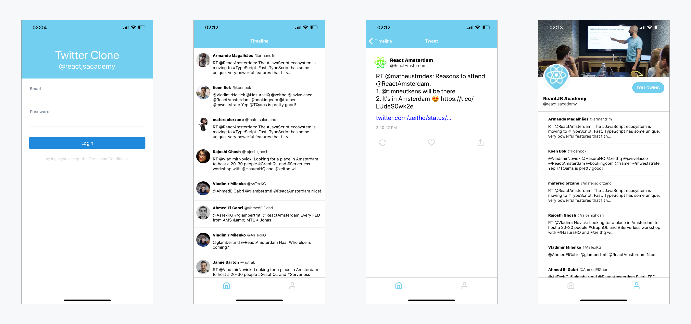

# React Native Workshop - ReactJSAcademy



You can checkout the individual original screenshots [here](./originals)

## Setup

```
git clone <REPO>
cd react-native-workshop
yarn install
# or
npm install
```

## Run your project

There are Two major ways to run yout Expo projects locally: using EXPO CLI, or running it in your Simulator (Xcode or Android Studio, Genymotion...). I recommend installing exp in your cli and login into your account in order to run your project directly into your phone.

### using Expo CLI

```bash
yarn add global expo-cli
# or

npm i -g expo-cli
expo init MY_PROJECT_NAME
cd MY_PROJECT_NAME
expo start
```

This will start the Bundler for the app and enables the app for visualization at your phone. Now you only need to go to your phone to the `Projects` tab and Voila!, there it is!!

Happy Coding!

## Excersice

### Foundation

- Go to [Expo Snack](https://snack.expo.io) and create a Screen from Scratch. we recommend you to create the Login Screen.
- clone this repo and copy and paste your LoginScreen to use it.
- fix the `TOCScreen` (`src/Screens/TOCScreen.js`) so the user can see the whole content. you need to add something in order for the screen to scroll.
- go to `src/Screens/TimelineScreens` and implement a FlatList for the data that is fetched.
- create a `TweetItem` component in `src/Components/TweetItem` and use it in your FlatList.

### Navigation

#### `src/Screens/PublicNavigator.js`

- create a Stack Navigator that shows the LoginScreen & the Terms and Conditions screen
- Add some options to the navigator:
  - headerMode: none
  - initialRouteName: LOGIN_SCREEN (optional)
  - mode: 'modal'

*Hint:* use the strings above to name your screens to maintain consistency when navigating.

#### `src/Screens/RootNavigator.js`

- create a Switch Navigator called `MainNavigator` with a PRIVATE and a PUBLIC view (check the imports!)
- this navigator should not have a header (hint: `headerMode`)
- this is the initial navigator for the App, so you need to wrap the entry point of your app with `createAppContainer`

#### `src/Screens/TimelineNavigator.js`

- Render your TimelineNavigator here instead of the `TimelineScreen`
- create a stack Navigator for the TimeLine tab.

```js
  [TIMELINE_FEED_SCREEN]: TimelineScreen,
  [TWEET_DETAIL_SCREEN]: TweetDetailScreen,
  [OTHER_USER_PROFILE]: ProfileScreen,

```

- the header backgroundColor for this navigator should be `Colors.brand.primary` and the header content is `white`.

#### `src/Screens/TimelineScreen.js`

- the header title for this view should be `Timeline`
- navigate to `TWEET_DETAIL_SCREEN` passing the id as a param

#### `src/Screens/PrivateNavigator.js`

- Define getTabBarIcon and use if to assign Icons to both Views
- Render the `TimelineNavigator` here instead of the `TimelineScreen`. HINT: you should implement something here inside `defaultNavigationOptions`

### Animations

- Go to [Expo Snack](https://snack.expo.io) and create a simple animation of a circle that changes the scale on `componentDidMount`.
- Now trigger the animation whenever the user Presses the circle.
- go to `src/Timeline/Screens/ProfileScreen` and animate the header onScroll. follow the instructions in the file.


## Resources

- https://facebook.github.io/react-native/
- https://docs.expo.io/versions/latest/
- https://reactnavigation.org/docs/en/getting-started.html
- https://react-native-training.github.io/react-native-elements/
- https://callstack.github.io/react-native-paper/
- https://nativebase.io/
- https://native.directory/

## Who to follow:

- https://twitter.com/reactnative
- https://twitter.com/reactiflux
- https://twitter.com/greweb
- https://twitter.com/ReactEurope
- https://twitter.com/react_native_eu
- https://twitter.com/ReactAlicante
- https://twitter.com/R_N_Radio
- https://twitter.com/Baconbrix
- https://twitter.com/dabit3
- https://twitter.com/kurtiskemple
- https://twitter.com/expo
- https://twitter.com/grabbou
- https://twitter.com/notbrent
- https://twitter.com/ferrannp
- https://twitter.com/infinite_red
- https://twitter.com/ChainReactConf
- https://twitter.com/VladimirNovick
- Twitter API auth process: https://stackoverflow.com/questions/45078952/twitter-api-application-only-authentication
